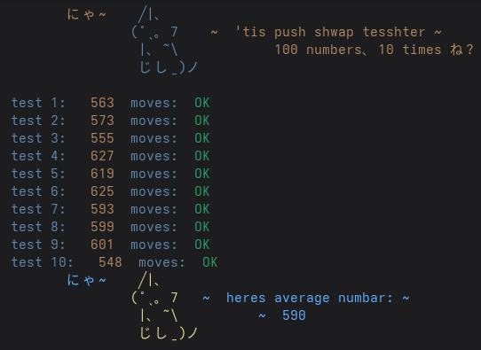
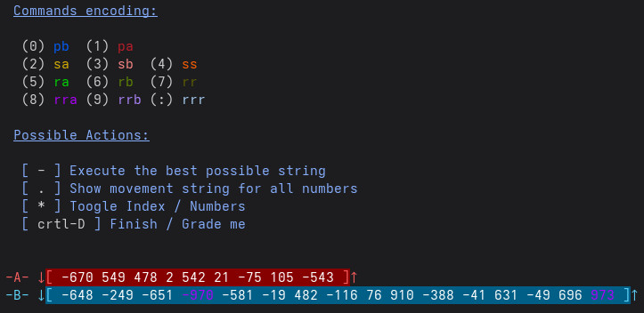

# push_swap

42 project about sorting numbers using two stacks and a limited set of operations.

## Usage

```bash
make
./push_swap 2 1 3 6 5 8 9
```

---

## Allowed Operations

- `sa` : swap the first 2 elements of stack A
- `sb` : swap the first 2 elements of stack B
- `ss` : perform `sa` and `sb` at the same time
- `pa` : push the top element from stack B to stack A
- `pb` : push the top element from stack A to stack B
- `ra` : rotate stack A upward by 1
- `rb` : rotate stack B upward by 1
- `rr` : perform `ra` and `rb` at the same time
- `rra` : reverse rotate stack A downward by 1
- `rrb` : reverse rotate stack B downward by 1
- `rrr` : perform `rra` and `rrb` at the same time

---

## Makefile Shortcuts

```bash
make a   # run push_swap with predefined arguments
make b   # run visual checker with predefined arguments
make c   # run push_swap with randomly generated numbers
make d   # run visualizer with randomly generated numbers
```

The predefined arguments and random generation settings can be found in the `Makefile`:

```bash
ARG(s)          # predefined test arguments
MIN             # minimum value for random generation
MAX             # maximum value for random generation
HOW_MANY        # amount of numbers to generate
HOW_MANY_TIMES  # amount of random tests to run
```

---

## Embedded Tester



This project includes a small Makefile-based testing toolkit for your own `push_swap`.

Simply copy-paste the entire Makefile_tester into your own `Makefile`.

Or clone this entire project at the root of your own project, and:

```bash
cat kali_push_swap/Makefile_tester >> Makefile
```

### Requirements

```bash
NAMEE = push_swap
CHECKER_NAME = checker_linux
```

- `NAMEE` must match your executable name
- Place the school checker at the root of your project
- Make sure its filename matches `CHECKER_NAME`

---

### Available Commands

```bash
make a   # run push_swap once with random numbers

make m   # run multiple randomized tests and display the average move count
         # in case of KO, the failing output is saved automatically for your convenience

make n   # test invalid arguments with valgrind
```

---

### Configuration

```bash
MIN             # minimum generated value
MAX             # maximum generated value

HOW_MANY        # amount of generated numbers
HOW_MANY_TIMES  # number of repeated tests
```

---

## Visual Checker



---

### Usage

`./visualiser` reads one or multiple operations from standard input:

- either in the standard format:
  ```text
  ra rb sa
  ```

- or in the shortened internal format:
  ```text
  0123881::5
  ```

---

Special control characters can also be used:

- `-` : execute the current shortest move sequence to place a number near its target
- `.` : display the best control string for all numbers
- `*` : toggle display between values and indexes
- `Ctrl-D` : stop execution and check whether the stacks are correctly sorted


---

### VISUALISE YOUR OWN ALGORITHM
### Installation & Setup

```bash
# clone this project at the root of your own:
git clone https://github.com/kalips003/push_swap kali_visu

# <!> if not already done:
# Append the tester rules to your Makefile
cat kali_visu/Makefile_tester >> Makefile

# Build and run
make see
```

---
---
---

### dont read this
- the pushswap output has escape sequences for colors, it therefore doesnt pass it's own test on the visualiser. To make it work, uncomment the uncolored names in inc/defines.h